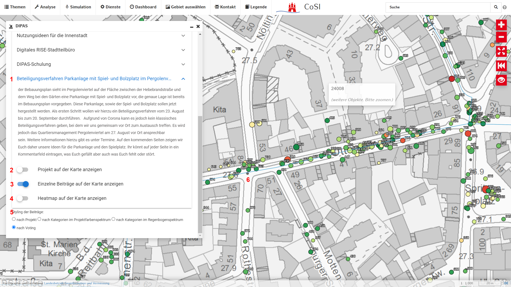

### DIPAS
Mit dem DIPAS Werkzeug können alle Beiträge aus laufenden DIPAS Verfahren in der Karte visualisiert, nach verschiedenen Kriterien dargestellt und für alle CoSI-Werkzeuge verfügbar gemacht werden. D.h. alle Beiträge können in der [Einrichtungsübersicht](./einrichtungsuebersicht.md) angezeigt, für [Versorgungsanalyse](./versorgungsanalyse.md), [Erreichbarkeitsanalyse](./erreichbarkeitsanalyse.md) und [Vergleichbare Gebiete Ermitteln](./vergleichbare-gebiete-ermitteln.md) verwendet und mit dem [Filter](./filter.md) gefiltert werden.

*Abbildung 12: DIPAS*

1. **Beteiligungsverfahren auswählen**
   > Für jedes Verfahren aus der DIPAS-Datenbank wird automatisch eine Registerkarte angelegt, welche durchs Anklicken aufgeklappt werden kann. Ein aufgeklapptes Verfahren zeigt dessen Beschreibungstext und die Kontrollfelder für die Visualisierung. Jedem Verfahren wid dabei eine zufällige Farbe zugewiesen.
2. **Verfahren in der Karte anzeigen**
   > Zeigt das Verfahrensgebiet als Polygon in der Karte in der jeweiligen Farbe des Verfahrens.
3. **Einzelne Beiträge in der Karte anzeigen**
   > Zeigt alle Einzelbeiträge des Verfahrens in der Karte. Das Styling der Beiträge kann unten (s. 5.) festgelegt werden.
4. **Heatmap in der Karte anzeigen** 
   > Zeigt eine Heatmap der Beiträge in der Karte. Das Gewicht eines Punktes richtet sich dabei nach der Gesamtzahl der Bewertungen des Beitrags, also der Stärke der Resonanz auf ihn.
5. **Styling der Beiträge wählen**
   > - nach Projekt: Alle Beiträge werden gleichmäßig in der Projektfarbe dargestellt.
   > - nach Kategorien im Projektfarbraum: Jede Kategorie wird in einer Schattierung der Projektfarbe dargestellt.
   > - nach Kategorien im Regenbogenspektrum: Jeder Kategorie wird eine zufällig Farbe zugewiesen.
   > - nach Bewertung: Die Beiträge werden abhängig von den positiven- und negativen-Bewertungen dargestellt. Die Größe des Punktes richtet sich dabei nach der Gesamtzahl der Reaktionen, die Farbe nach dem Verhältnis von positiven (grün) und negativen (rot) Bewertungen.
6. **Beiträge in der Karte**
   > Alle Beiträge werden mit ihrer ID (einer fortlaufenden Nummer) in der Karte dargestellt.

